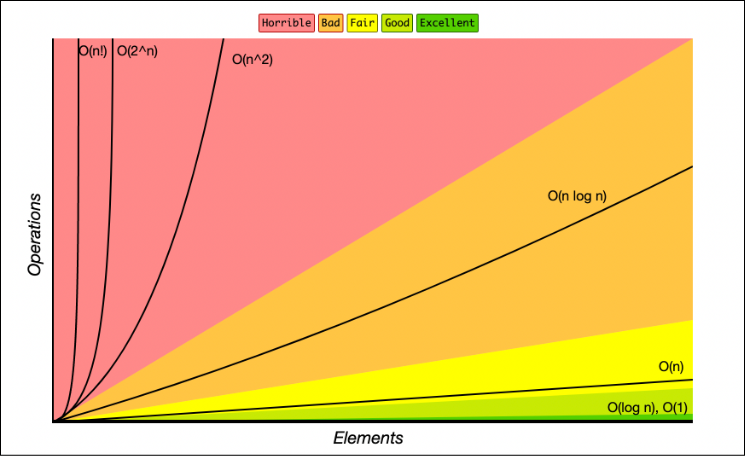

# Algoritmo de Visibilidad

Al simular la estructura de un programa real se responderá a las preguntas teniendo el cuenta principalmente el algoritmo desarrollado en el servicio donde se implementa el algoritmo de visibilidad.
Se tendrá también en cuenta la implementación en el resto de capas, pues son esenciales para el funcionamento.

## Estructuras de datos utilizadas

```
Una vez realizado el problema del algoritmo de visibilidad, comenta qué estructuras de datos (Listas,
Sets, etc) has seleccionado para resolverlo y porque las has considerado como las más adecuadas en
cada caso.
```

Para la resolución de este algoritmo en la función "getVisible()" se a optado por el uso de *sets* para los distintos grupos. Finalmente se ha hecho uso de una lista a la hora de devolver los elementos a mostrar.

Las operaciones sobre los grupos utilizan sets por la baja complejidad que tienen a la hora de realizar operaciones.
En cambio, a la hora de devolver los elementos a mostrar se utiliza una lista puesto que el orden de los elementos es importante de cara a mostrar los ids de resultado.

En servicios y objectos como *daos* y *dtos* se hace uso de listas como estructuras de datos para contener los elementos y no es hasta la función de visibilidad donde se convierten a sets para ser utilizados.
Sería pues interesante el uso de estas estructuras como sets durante todo el programa.

## Complejidad temporal del algoritmo

```
Una vez resuelto el algoritmo de visibilidad. ¿Qué complejidad temporal expresada en notación “O”
crees que tiene? ¿Consideras que se podría mejorar de alguna manera?
```

Teniendo en cuenta la implementación hecha en los servicios se estaría hablando de una complejidad temporal de O(n^2).

Tomando como ejemplo la función "getStrictlyRegular()" del servicio "ProductService" primero se hace un recorrido tipo O(n) (siendo n el número de elementos de la lista) al realizar un *filter* sobre cada elemento de la lista "regulars".
Después, dentro de este *filter* se hace un *noneMatch* sobre cada elemento de la lista "specials", lo que sería un O(m) (siendo m el número de elemento de la lista).
Al ser estas operaciones anidadas el resultado sería O(n*m) y al considerar estas listas como de tamaño similar se podría simplificar como O(n^2).

Como se puede comprobar en la imagen final este es un resultado bastante malo.
Para mejorarlo, sería necesario hacer uso de *sets* en lugar de listas a lo largo de todo el programa (como ya se indicó en la pregunta anterior).

Haciendo este cambio al uso de *sets* la complejidad bajaría hasta O(n log n) (siendo n el número total de elementos), lo cual sería mucho mejor. Sería O(n log n) y no O(n) debido al cambio del set a lista final antes de la devolución.

Si la implementación de estes servicios se hiciese por medio de una búsqueda SQL la complejidad temporal también sería O(n log n) manteniendo la misma implementación del código.

La búsqueda en base de datos puede ser O(log n) si esta se encuentra indexada, O(n) en caso contrario (siendo n el número de elementos de la tabla).
Y aunque las operaciones sobre los *sets* son O(n) la conversión a lista final sigue siendo O(n log n).

Se podría mejorar intentando buscar otra forma de conversión a lista que tuviese una menor complejidad temporal.
En esta implementación del servicio se devuelve una lista de objectos "ProductDvo" porque será esta la que después se pintará por pantalla ante la llamada del endpoint.
Pero teniendo en cuenta que la devolución final es un *string* se podría considerar el hacer esta conversión aquí mismo.
Lo cual sería de una complejidad de O(n) de usar el método "toString()", reduciendo la complejidad total a O(n).

Sin embargo esto depende de las necesidades particulares del programa y, aunque en este caso si funcionaría, habría que considerar si es interesante que este servicio devuelva el *string* con los ids en lugar de una lista de objectos.

